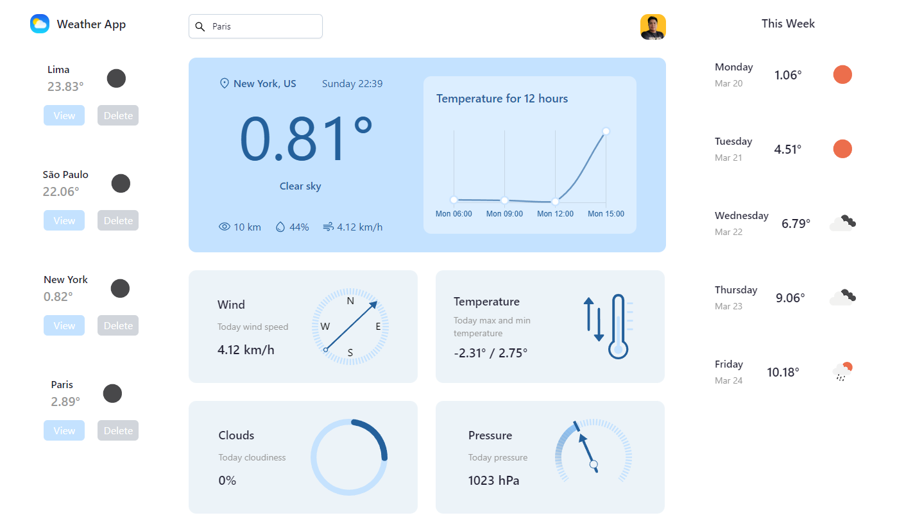

# 💻 SunCloud - Weather App
     

<p align="letf">
  
</p>

## 🔗Links

Deploy: [Wheater App](https://weather-app-react-redux-tailwind.vercel.app/)

## Enunciado

Aplicación creada con el consumo del api de ["Open Weather"](https://openweathermap.org/). 

### Requisitos:

Debe crear una cuenta en ["Open Weather"](https://openweathermap.org/) para poder generar el `Api Key`. Luego debe editar el archivo `/src/.env_test` a `/src/.env` y pegar el `Api Key` en el campo correspondiente.

```env
VITE_API_KEY = 
VITE_API_URL = https://api.openweathermap.org/data/2.5/
```

### Inicializar en desarrollo:

```env
npm install
npm run dev
```

### Inicializar en producción:

```env
npm install
npm run build
```